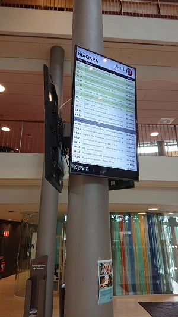

# Kronox

This is a fork for our existing system at SLU. As of Jan 1st 2020 we are retiring KronoX but here over the next few days I will upload the small changes we made to k3larra's excellent Kronox program. Notably we have support for extended characters and we have hard coded room names instead of room codes. I hope this is of use to others. Mvh Ian

At Sveriges lantbruksuniversitet (Alnarp, Alnarpsgården), it looks like this, and ran for two years on a Raspberry Pi 3:

K3larra's original text:

This code is used to view Kronox data for a specific building on a Full HD screen in portrait mode.
In my case, it runs on a remotely controlled Raspberry Pi that downloads a jarfiles and runs them or shows webpages (another story). 
(You can run the code from any computer with a screen in portrait mode.)

Change in the file Constants.java and some of the images in the assets directory to adapt it.

The jarfile should run directly if you have java jre or jdk istalled on the computer.
/L

At Malmö University, it looks like this:

